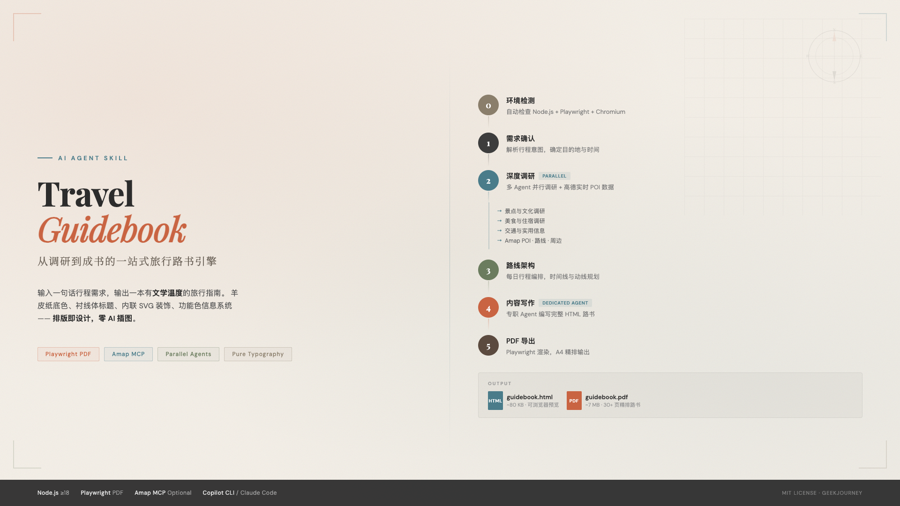
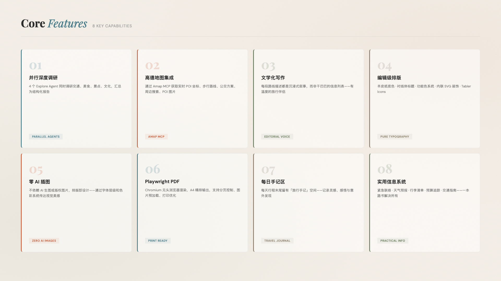
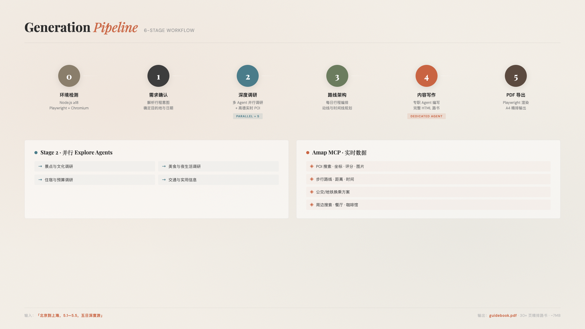
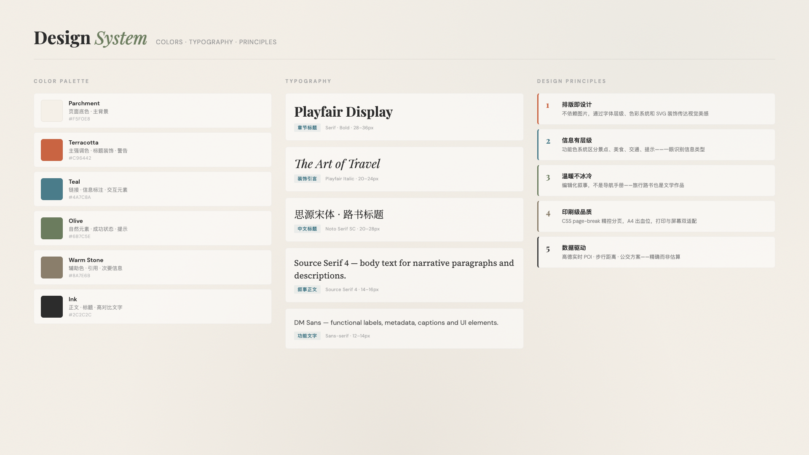

<div align="center">

# Travel Guidebook

**从调研到成书的一站式旅行路书引擎**



[](./LICENSE)
[](#安装)
[](https://nodejs.org)

</div>

---

## 这是什么

一个 AI Agent Skill，输入一句话行程需求，输出一本精美的旅行路书 PDF。

```
输入：「北京到上海，5.1 到 5.5，五日深度游」
输出：beijing_shanghai_guidebook.pdf  (7MB, 30+ 页精排路书)
```

不是模板填充，不是信息堆砌——而是一本有**文学温度**的旅行指南：  
羊皮纸底色、衬线体标题、内联 SVG 装饰、功能色信息系统、每日手记区。

---

## 核心特性



---

## 工作流程



---

## 安装

### 前置依赖

```bash
# Node.js >= 18
node -v

# Playwright + Chromium (PDF 导出引擎)
npm install playwright
npx playwright install chromium
```

### 安装 Skill

```bash
npx skills add travel-guidebook
```

### 高德地图 MCP（可选，推荐）

配置后可获取实时 POI 数据、步行路线、公交方案。

```jsonc
// ~/.copilot/mcp-config.json
{
  "mcpServers": {
    "amap-maps": {
      "command": "npx",
      "args": ["-y", "@amap/amap-maps-mcp-server"],
      "env": {
        "AMAP_MAPS_API_KEY": "your_amap_api_key"
      }
    }
  }
}
```

> 在 [高德开放平台](https://console.amap.com/) 申请 Web 服务 API Key（免费）。

---

## 快速上手

安装完成后，在 Copilot CLI / Claude Code 中直接对话：

```
> 北京到上海，5.1 到 5.5，五日深度文化游

> 成都到重庆，自驾三日游，美食为主

> 杭州周末两日游，带老人和小孩
```

Skill 会自动识别触发词（路书、旅行指南、行程规划等），  
启动完整的 6 阶段工作流。

---

## 输出示例

```
project/
├── beijing_shanghai_guidebook.html   # 82KB 自包含 HTML
└── beijing_shanghai_guidebook.pdf    # 7.1MB 打印级 PDF
```

### 路书包含

```
┌─────────────────────────────────────────┐
│  封面                                    │
│  ├─ 指南针 SVG 装饰                     │
│  ├─ 路线标题 + 主题标签                  │
│  └─ 双线边框装饰                        │
├─────────────────────────────────────────┤
│  旅程概览                                │
│  ├─ 天数 / 里程 / 季节 / 预算            │
│  └─ 核心亮点                            │
├─────────────────────────────────────────┤
│  行前准备                                │
│  ├─ 证件 / 装备 / 天气穿衣              │
│  ├─ 预算表格 (经济/中档/高端)            │
│  └─ 实用 APP 推荐                       │
├─────────────────────────────────────────┤
│  Day 1 ~ Day N  (每天独立章节)           │
│  ├─ DAY 编号 SVG 徽章                   │
│  ├─ 日程卡片 (交通/天气/亮点)            │
│  ├─ 文学化路线描述 (首字下沉)            │
│  ├─ 景点卡片 (POI 图片 + 地址 + 评分)   │
│  ├─ 美食推荐 (实景图 + 人均 + 招牌菜)   │
│  ├─ 住宿推荐                            │
│  ├─ 今日贴士                            │
│  └─ 手记区 (虚线笔记 + 票根位)          │
├─────────────────────────────────────────┤
│  深度游专题 (2-3 篇)                     │
│  ├─ 历史脉络                            │
│  ├─ 文化特色                            │
│  └─ 当地人视角                          │
├─────────────────────────────────────────┤
│  实用附录                                │
│  ├─ 紧急联系 / 方言用语                 │
│  ├─ 费用明细表                          │
│  └─ 推荐歌单                            │
├─────────────────────────────────────────┤
│  封底 + 旅途感言                         │
└─────────────────────────────────────────┘
```

---

## 设计系统



---

## 项目结构

```
travel-guidebook/
├── SKILL.md                          # Skill 定义 (Agent 读取)
├── README.md                         # 本文件
├── LICENSE                           # MIT
├── references/
│   ├── layout-css.md                 # CSS 排版规范
│   ├── chapter-templates.md          # HTML 章节模板
│   └── report-template.md            # 调研报告模板
└── scripts/
    └── html2pdf.mjs                  # Playwright PDF 导出
```

---

## 技术栈

| 层级 | 技术 | 用途 |
|------|------|------|
| Agent 框架 | Copilot CLI / Claude Code | Skill 运行环境 |
| 并行调研 | explore agents × 4 | 交通/美食/景点/文化 |
| 空间数据 | Amap MCP (高德地图) | POI / 路线 / 天气 |
| HTML 写作 | general-purpose agent | 独立上下文写作 |
| 排版引擎 | CSS @page + break rules | A4 精确分页 |
| 图标系统 | Tabler Icons (CDN) | 1800+ 线性图标 |
| 字体 | Google Fonts (CDN) | 中文衬线 + 无衬线 + 等宽 |
| PDF 导出 | Playwright + Chromium | 打印级渲染 |

---

## 常见问题

<details>
<summary><b>PDF 中图片不显示？</b></summary>

图片使用了 `loading="lazy"` 时，Playwright 打印模式不会触发懒加载。  
解决：确保 `html2pdf.mjs` 中包含图片等待逻辑，或将图片改为 `loading="eager"`。

</details>

<details>
<summary><b>高德 API 报 QPS 限制？</b></summary>

免费 Key 的 QPS 上限较低。Skill 内置了降级策略：API 失败时自动回退到 LLM 知识库数据。  
建议避免同时发起超过 3 个高德 API 请求。

</details>

<details>
<summary><b>没有高德 MCP 能用吗？</b></summary>

可以。Skill 在 Stage 0 自动检测 Amap MCP 是否可用，不可用时退回 LLM 知识模式。  
路书质量略有下降（缺少实时 POI 坐标和图片），但核心功能完整。

</details>

<details>
<summary><b>如何自定义样式？</b></summary>

修改 `references/layout-css.md` 中的 CSS 变量即可。  
配色、字体、字号、间距均通过 CSS 自定义属性控制。

</details>

---

## 路线图

- [x] 6 阶段工作流
- [x] 并行 Agent 调研架构
- [x] 高德地图 MCP 集成
- [x] POI 实景图片嵌入
- [x] Playwright PDF 导出
- [ ] 多语言路书支持 (EN / JA / KO)
- [ ] 交互式 HTML 版本 (地图嵌入)
- [ ] 自定义主题 (暗色 / 莫兰迪 / 赛博朋克)
- [ ] 路书分享与协作

---

## 许可证

[MIT](./LICENSE) — 自由使用、修改、分发。

---

<div align="center">

```
  ◇ ─── 旅行不是为了到达，而是为了在路上。 ─── ◇
```

</div>
